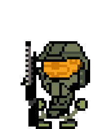
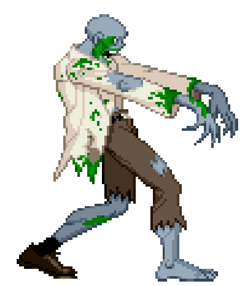

  <h1>Juan Pablo Bareño Sierra</h1>
  <h2>Desarrollador Back-End Junior | Apasionado por la eficiencia y la escalabilidad</h2>

---

  
  
  
  

---

### 💻 Sobre mí

> Soy un **Desarrollador Back-End Junior** con una sólida base en **Python, JavaScript y MongoDB**. Cuento con experiencia en el diseño y la implementación de RestApis. Me enfoco en escribir código limpio, eficiente y bien documentado, priorizando la **escalabilidad** y el rendimiento que brinda cada una de mis experiencias web.
>
> Cuento con muy buenas bases para trabajar con metodologías ágiles como **Scrum** y estoy en constante búsqueda de optimizar procesos con herramientas de gestión como **Github** y **ClickUp**. Mi objetivo es crecer profesionalmente en un entorno que valore la innovación y el desarrollo de software.
>
> 🚀 **Mi stack principal:** Python, MongoDB, JavaScript.

---

### ✨ Proyectos Destacados

  

<strong>Ver Proyectos</strong>

 

| Nombre del Proyecto | Descripción | Tecnologías Clave | Enlace |
| :--- | :--- | :--- | :--- |
| **Gestor de Gastos Financieros** | Desarrollé un Gestor de Gastos Personales utilizando Python. El aplicativo permite a los usuarios registrar y clasificar gastos financieros con granularidad diaria, semanal, mensual y anual. Cada registro incluye una descripción detallada y la fecha de realización. Implementé persistencia de datos mediante el uso del formato JSON para asegurar el almacenamiento y la recuperación eficiente de la información. | **Python, JSON** | [Ver Repositorio](https://github.com/Shilohzz/Proyecto_Python_Bare-oJuan.git) |
| **Juego de Cartas** | Desarrollé un juego de mesa interactivo utilizando JavaScript. El proyecto se centró en el consumo de una REST API externa para la gestión y provisión de mazos de cartas de póker reales. Esta experiencia me permitió aplicar y consolidar conocimientos en el diseño de la lógica del juego y la integración de servicios web. | **HTML, CSS, RestAPI JavaScript** | [Ver Repositorio](https://shilohzz.github.io/JavaScript_S2_BarenoJuan/Dia10) |

---

### 🏅 Competencias Blandas (Soft Skills)

  
  
  
  

---

### 🛠️ Tecnologías y Herramientas

  

  
  
  
  
  
  
  
  
  
  
  
  

--- 

### 📊 GitHub Stats

  
   
  

---

